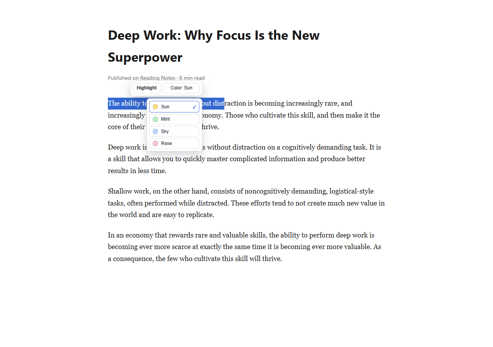
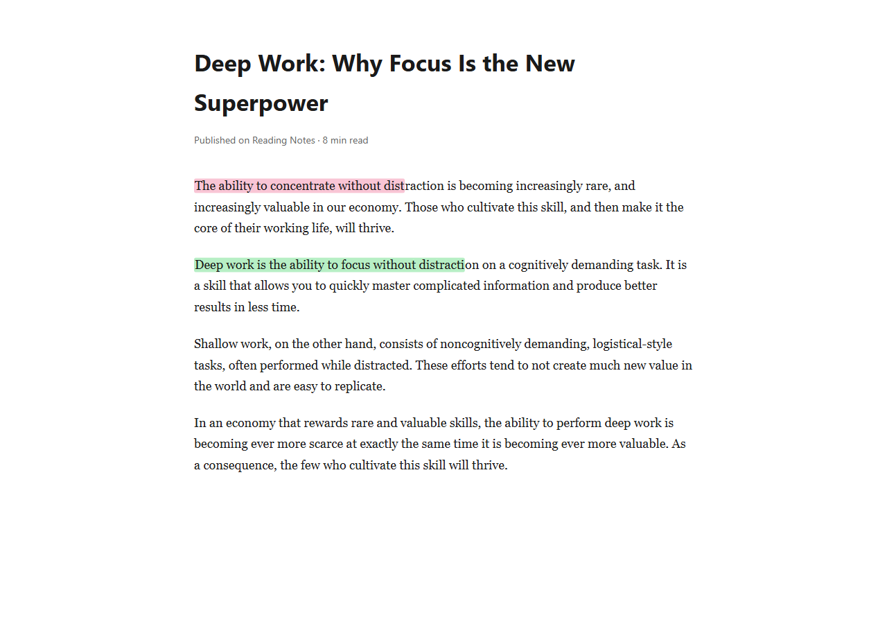
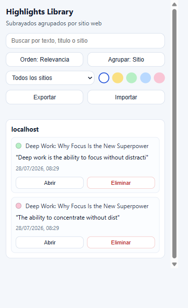

# Simple Highlights

Text worth remembering gets lost the moment a tab closes. Simple Highlights solves that: a Chrome extension (Manifest V3) that lets anyone mark text on any website and get it back automatically the next time they visit the same page — no account, no cloud service, no setup beyond installing it.

The workflow is deliberately minimal:

1. Select text on any page.
2. Highlight it with a floating toolbar.
3. Revisit the page later and see the highlight restored.
4. Open the popup to search, sort, filter, and browse the saved library.

## Screenshots

| Floating toolbar & color picker | Highlighted passage | Popup library |
| --- | --- | --- |
|  |  |  |

## Product Snapshot

- Highlights survive page reloads, dynamic content, and single-page app navigation — restoration isn't limited to a static page load.
- Four pastel highlight colors, applied through a compact floating toolbar with no page redirection or extra clicks.
- A persistent local library in `chrome.storage.local`, with full highlight text stored (no length cap, no truncation-driven data loss).
- A restoration algorithm that matches text spanning multiple DOM nodes and disambiguates repeated phrases using surrounding context.
- A popup library with live search (accent- and punctuation-tolerant), four sort modes, site/color filters, and grouped or flat views — all preferences persisted across sessions.
- One-click navigation from a saved entry back to its highlight, opening the source tab if it isn't already open.
- Delete a highlight from the popup directly, without needing to revisit the page.
- Full library export and import as JSON, for backup or migration between profiles.
- Every storage write is serialized through the background service worker, so concurrent tabs can't silently overwrite each other's highlights.

## Interface Language

The extension UI is currently in Spanish, including popup labels, helper copy, and interaction messages. This documentation is written in English to keep the project accessible to a broader developer audience.

## Feature Detail

### Highlighting

A floating toolbar appears near the current text selection, letting the user apply a highlight or switch colors in place. The last color chosen is remembered for the session, with a checkmark marking the active swatch.

### Highlight Removal

Hovering an existing highlight reveals a `Remove` button that stays visible briefly and fades out rather than disappearing abruptly. Highlights can also be deleted directly from the popup library; any open tab currently showing that highlight removes it live, via a background broadcast.

### Persistent Library

Each saved highlight records:

- Unique id.
- Original page URL and hostname.
- Page title.
- Full highlight text — stored without truncation, so long selections restore correctly.
- Selected color.
- Creation timestamp.
- Prefix and suffix context, used to disambiguate repeated text on restoration.

### Restoration

Highlights restore automatically on return visits to the same URL, including a retry pass for content that renders after `document_idle`. Matching isn't limited to single text nodes, and repeated text is resolved accurately through stored context. On single-page apps, a URL-change watcher unwraps stale highlights and re-runs restoration for the new route without requiring a full page reload.

### Popup Library

The popup surfaces the full saved collection with live, accent-tolerant search; sorting by relevance, newest, oldest, or site A-Z; filtering by site and by color; and a toggle between grouped-by-site and flat-list views. All of these preferences persist across popup sessions. Per-entry actions let a user jump straight to a highlight's tab (opening the page if it's closed), delete the entry outright, or export/import the entire library as a JSON file — re-importing the same file is a safe no-op, since existing ids are skipped.

## Project Structure

```text
SIMPLE-HIGHLIGHTS/
  manifest.json
  README.md
  scripts/
    generate-icons.ps1
  src/
    assets/
      icons/
        icon-16.png
        icon-32.png
        icon-48.png
        icon-128.png
    background/
      service-worker.js
    content/
      content-script.js
      modules/
        floating-toolbar.js
        highlighter.js
        selection.js
        spa-watcher.js
        state.js
      styles/
        highlight.css
    popup/
      popup.css
      popup.html
      popup.js
    shared/
      highlight-library.js
```

## Technical Notes

- Built as a Chrome Extension using Manifest V3, with a background service worker as the single writer for `chrome.storage.local`. Content scripts and the popup reach it via `chrome.runtime.sendMessage`, closing a race condition where two tabs saving near-simultaneously could otherwise drop one highlight.
- DOM manipulation relies exclusively on safe APIs — `Range`, `Selection`, `createElement`, `textContent` — with no `eval()` or `innerHTML` in core UI rendering.
- `chrome.storage.local` holds both the highlight library and popup preferences.
- The `tabs` permission lets the popup locate, focus, or open the tab a highlight belongs to, and lets the background worker broadcast removals to any open tab.

## Security Notes

- Strict extension page CSP: `script-src 'self'`, `object-src 'none'`, `base-uri 'none'`.
- Minimal permission scope: `storage` and `tabs`.
- No deprecated background page model.

## Install Locally in Chrome

1. Open Chrome and go to `chrome://extensions/`.
2. Enable Developer Mode.
3. Click Load unpacked.
4. Select the `SIMPLE-HIGHLIGHTS` folder.
5. Open a website and select text.
6. Use the floating toolbar to highlight.
7. Open the extension popup to browse the saved library.

## Typical User Flow

1. Select a piece of text and click `Highlight`.
2. Hover the highlight later to remove it, or delete it from the popup.
3. Open the popup to search, filter, or organize saved highlights.
4. Use "Abrir" on a popup entry to jump straight back to that highlight, even in a closed tab.
5. Reopen the same page later and let the extension restore the saved marks.
6. Export the library periodically as a backup, or import one on a fresh profile.

## Current Limitations

- Restoration is tied to the exact URL saved with the highlight, including query strings — pages that append volatile parameters won't match.
- Extremely dynamic pages can still produce edge cases where restoration is incomplete.
- The icon set is a generated placeholder, not a designed brand asset.

## Roadmap Ideas

- Optional sync support for the highlight library and settings. `chrome.storage.sync` caps out at 100KB total / 8KB per item, too small for a full library with saved text and context — whether to sync settings only or build a quota-aware chunked library sync is an open decision, parked for a future pass.
- Combined per-color and per-site saved views (named smart filters).
- A dedicated icon/brand design to replace the generated placeholder.
